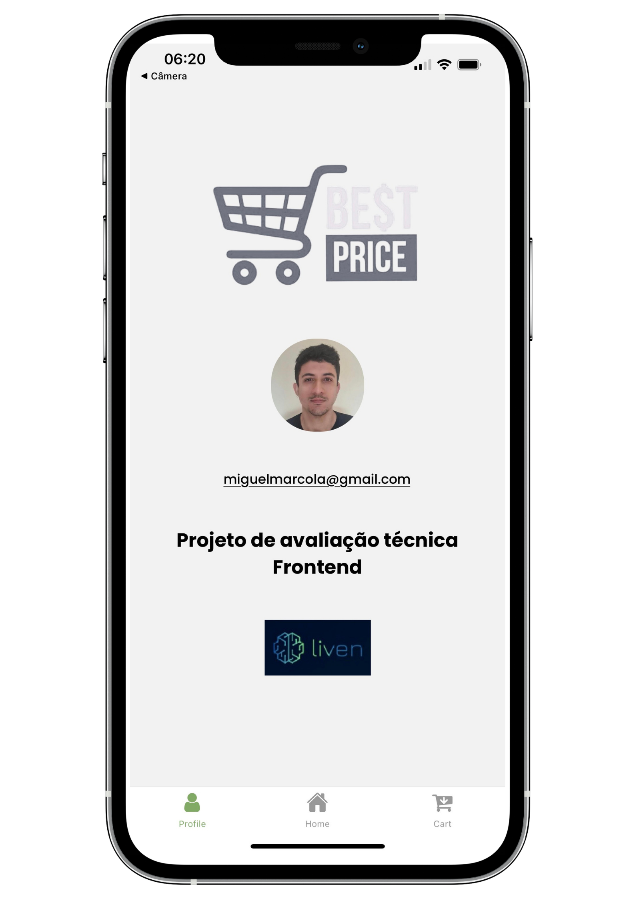
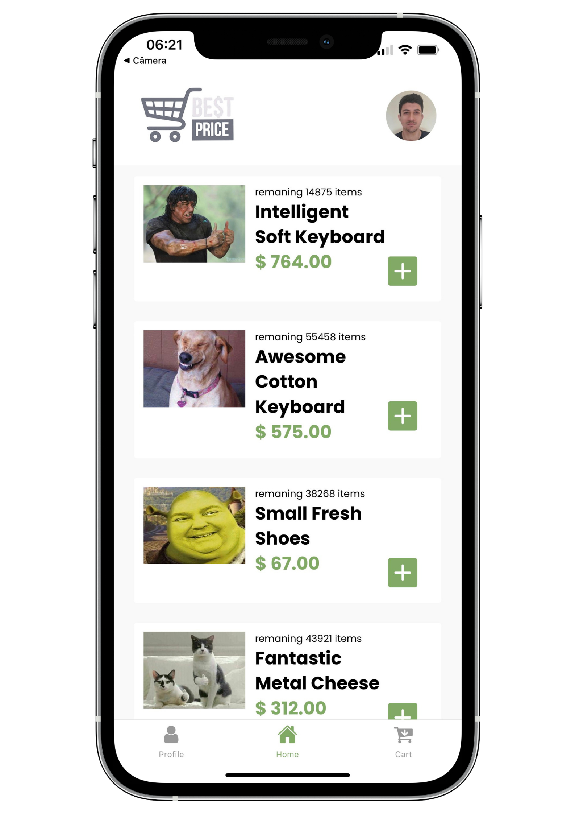
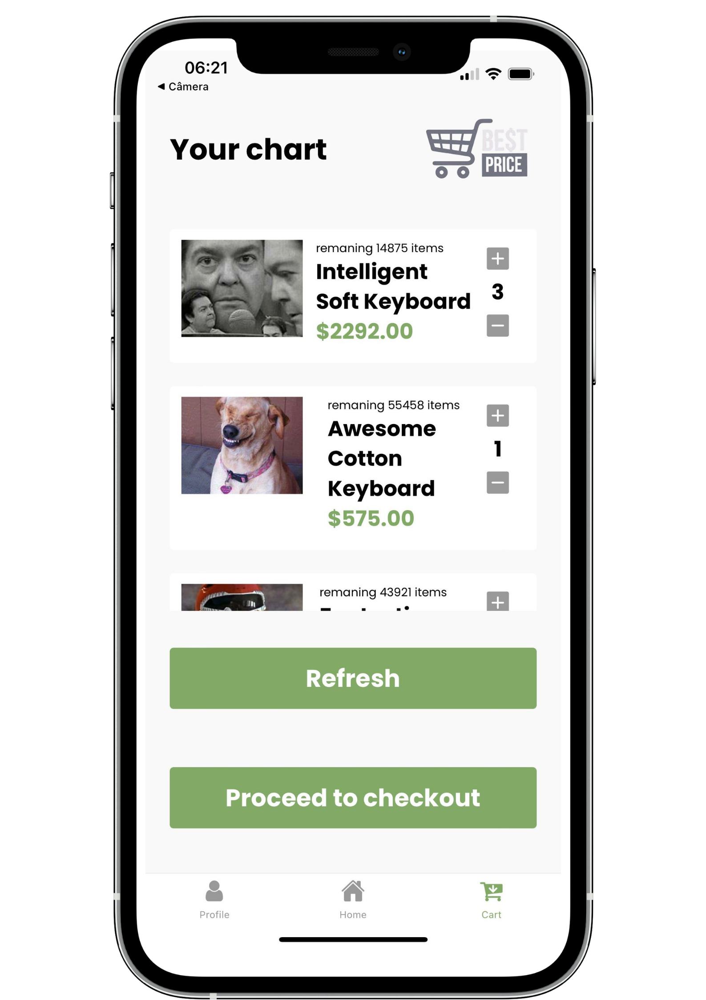

<h1 align="center">
     Mobile Frontend Project

</h1>

<h3 align="center">
    App de WebShop
</h3>

<p align="center">
  

  
  
  <a href="https://github.com/MiguelMarcola/Mobile-Frontend-Project/commits/main">
    
  </a>
    
   
  
  
  
 
</p>

<h4 align="center">
	🚧   Concluído 🚀 🚧
</h4>

## 💻 Sobre o projeto

Mobile Frontend Project - é uma aplicação desenvolvida em React Native com Typescript que consome uma API externa retornando uma lista de produtos que podem ser adicionados ao carrinho para a compra.

---

## ⚙️ Funcionalidades

- [x] Faz a consulta em uma api externa.
- [x] Permite adicionar items ao carrinho.
- [x] Permite visualizar o carrinho.
- [x] Permite aumentar ou diminuir a quantidade dos items no carrinho.
- [x] Permite finalizar a compra retirando todos os items no carrinho.
---

## 🎨 Layout

O layout da aplicação está disponível no Figma:

<a href="hhttps://www.figma.com/file/i8C3FvNOne6U4MwjYFZD0m/Projeto-Liven?node-id=0%3A1">
  
</a>

---

### Mobile

<p align="center">
  

  
  
</p>

---

## 🚀 Como executar o projeto

### Pré-requisitos

Antes de começar, você vai precisar ter instalado em sua máquina as seguintes ferramentas:
[Git](https://git-scm.com), [Yarn](https://yarnpkg.com/), [Expo](https://expo.dev/), um emulador virtual ou um dispositivo físico com o App [Expo Go](https://expo.dev/client) instalado. 
Além disto é bom ter um editor para trabalhar com o código como [VSCode](https://code.visualstudio.com/)

#### 🎲 Rodando 

```bash

# Clone este repositório
$ git clone git@github.com:MiguelMarcola/Mobile-Frontend-Project.git

# Acesse a pasta do projeto no terminal/cmd
$ cd Mobile-Frontend-Project

# Instale as dependências
$ yarn

# Execute a aplicação em modo de desenvolvimento
$ expo start

# O servidor inciará na porta:19002 - acesse http://localhost:19002

```


## 🛠 Tecnologias

As seguintes ferramentas foram usadas na construção do projeto:

#### **Website**  ([React Native](https://reactnative.dev/)  +  [TypeScript](https://www.typescriptlang.org/))

-   Expo
-   Styled-components
-   AsyncStorage

> Veja o arquivo  [package.json](https://github.com/MiguelMarcola/Mobile-Frontend-Project/blob/main/package.json)

## 🦸 Autor


 <br />
 <sub><b>Miguel Marçola</b></sub></a> 🚀
 <br />

[](https://www.linkedin.com/in/miguel-mar%C3%A7ola-28535a151/) 
[](miguelmarcola@gmail.com)

---

## 📝 Licença

Este projeto esta sobe a licença [MIT](./LICENSE).

Feito com muita dedicação por Miguel Marçola 👋🏽 [Entre em contato!](https://www.linkedin.com/in/miguel-mar%C3%A7ola-28535a151/)

---

